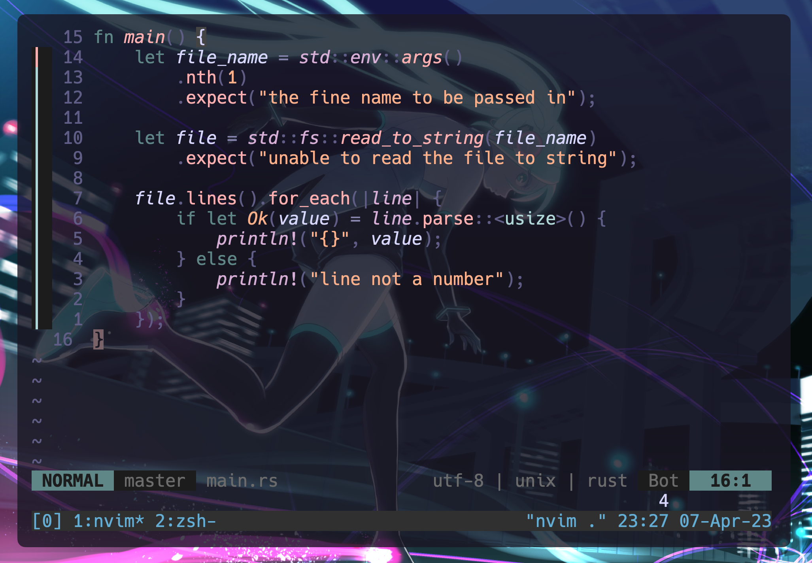
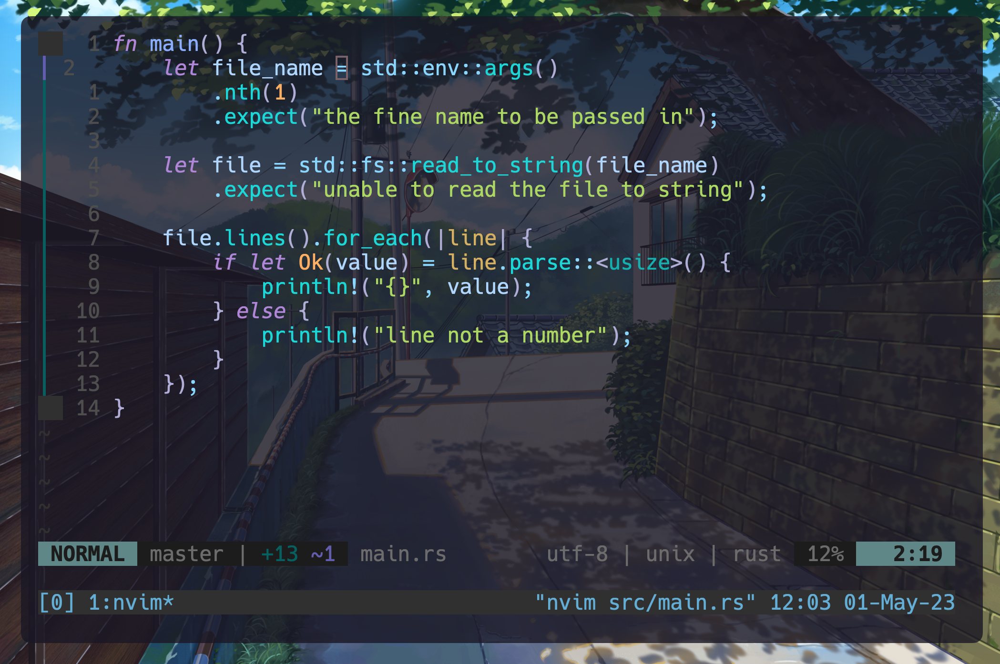
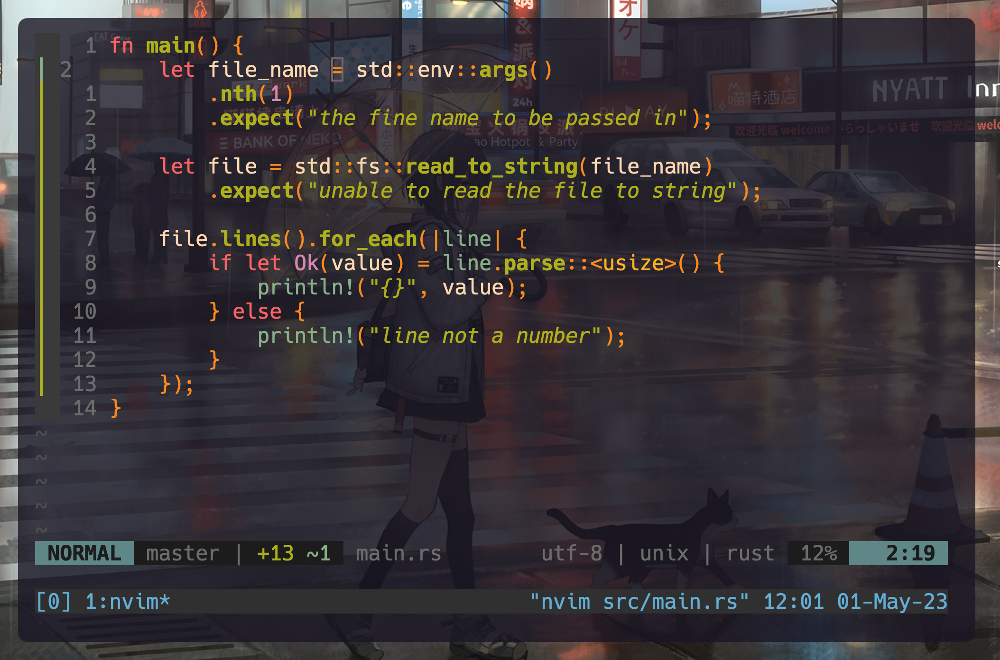

# .dotfiles



|                     |                                                                           |
|---------------------|---------------------------------------------------------------------------|
|Shell:               |[zsh](https://www.zsh.org/) + [ohmyzsh](https://github.com/ohmyzsh/ohmyzsh)|
|Editor:              |[neovim](https://github.com/neovim/neovim)                                 |
|Terminal:            |[alacritty](https://github.com/alacritty/alacritty)                        |
|Terminal-Multiplexer:|[tmux](https://github.com/tmux/tmux)                                       |

**Optional**, but highly recommended:

* [fzf](https://github.com/junegunn/fzf)
* [ripgrep](https://github.com/BurntSushi/ripgrep)
* [jq](https://github.com/stedolan/jq)

## Themes

|                                                         |                                                 |
|---------------------------------------------------------|-------------------------------------------------|
|[rose-pine](https://github.com/rose-pine/neovim)         |   |
|[tokyonight](https://github.com/folke/tokyonight.nvim)   |  |
|[gruvbox](https://github.com/ellisonleao/gruvbox.nvim)   |  |

## Switch theme

To swich the theme in a more simple way, we are using a simple bash script by just calling this alias.

```shell
colorscheme tokyonight
```

## Features

- `lsp-zero` manage [language servers](https://github.com/VonHeikemen/lsp-zero.nvim)
- `telescope.nvim` a highly extendable [fuzzy finder](https://github.com/nvim-telescope/telescope.nvim)
- `nvim-treesitter` [parsing library](https://github.com/nvim-treesitter/nvim-treesitter)
- `theprimeagen/harpoon` [buffer navigation](https://github.com/ThePrimeagen/harpoon)
- `undotree` visualizes the [undo history](https://github.com/mbbill/undotree)
- `lualine.nvim` fast and easy to configure Neovim [statusline](https://github.com/nvim-lualine/lualine.nvim)

